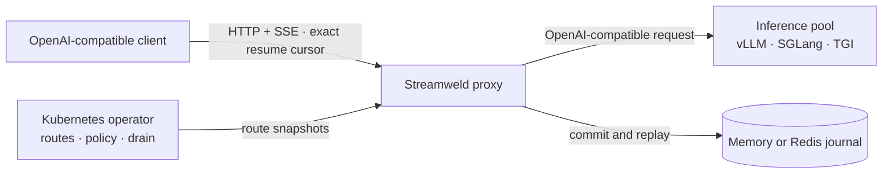

<h1 align="center">Streamweld</h1>

<div align="center">


Durable token streams for self-hosted LLM inference.

[Website](https://streamweld.vercel.app/) | [Documentation](https://streamweld.readthedocs.io/en/latest/) | [Get started](https://streamweld.readthedocs.io/en/latest/getting-started/) | [Architecture](https://streamweld.readthedocs.io/en/latest/concepts/architecture/) | [Discussions](https://github.com/satwiksps/streamweld/discussions)

[](https://github.com/satwiksps/streamweld/actions/workflows/ci.yml?query=branch%3Amain)
[](https://streamweld.readthedocs.io/en/latest/)
[](https://github.com/satwiksps/streamweld/actions/workflows/security.yml?query=branch%3Amain)
[](go.mod)
[](LICENSE)

</div>

Streamweld is an OpenAI-compatible durability layer for self-hosted LLM
inference. It gives each streaming generation an identity, an append-only
journal, and an exact resume cursor that can outlive a reader connection or
backend attempt.

> [!IMPORTANT]
> The current release is `v0.1.0`. APIs and `v1alpha1` Kubernetes resources may
> change during the 0.x release series.

## Install

Install the proxy and operator into Kubernetes with Helm:

```sh
helm upgrade --install streamweld oci://ghcr.io/satwiksps/charts/streamweld \
  --namespace streamweld-system \
  --create-namespace \
  --version 0.1.0 \
  --wait --timeout 3m
```

Install the dependency-free TypeScript client, or the Vercel AI SDK v5 adapter:

```sh
npm install @streamweld/client
npm install @streamweld/ai-sdk ai@^5
```

Prebuilt `streamweld-proxy`, `streamweld-operator`, and `streamweldctl` archives
for Linux, macOS, and Windows are available from
[GitHub Releases](https://github.com/satwiksps/streamweld/releases/tag/v0.1.0).

## Why Streamweld

Long LLM responses are vulnerable to pod failures, rolling updates, reclaimed
nodes, proxy timeouts, and client network changes. A normal retry restarts the
request and can discard generated output. Streamweld makes three operations
explicit:

- **Reader resume:** replay after an exact `Last-Event-ID`, then join the live tail.
- **Producer migration:** continue on a compatible backend only when every safety gate passes.
- **User stop:** cancel generation explicitly; a disconnected reader is not treated as stop.

## Architecture



The Go proxy owns the request and streaming data path. The journal owns ordered
events, replay, and terminal state. The Kubernetes operator manages eligible
backends and rollout draining without reading prompts or generated text.

## Run from source

Requirements: Go 1.25+, Node.js 22.12+, pnpm 11.19, and GNU Make 4+.

```sh
git clone https://github.com/satwiksps/streamweld.git
cd streamweld
make bootstrap
make test
```

Without Make, use `go mod download`, `pnpm install --frozen-lockfile`,
`go test ./...`, and `pnpm test` directly.

### Try a stream locally

The repository includes a deterministic CPU-only backend for testing. With Go
installed, run it in one terminal and the proxy in another:

```sh
go run ./test/chaos/backend
```

```sh
go run ./cmd/streamweld-proxy --backend http://127.0.0.1:8000 --listen 127.0.0.1:8080
```

From a third terminal, open a stream and display its response headers:

```sh
curl -i -N http://127.0.0.1:8080/v1/chat/completions \
  -H 'Content-Type: application/json' \
  -d '{"model":"streamweld/deterministic-chaos","messages":[{"role":"user","content":"Count steadily."}],"max_tokens":2048,"stream":true}'
```

In PowerShell 7, use `curl.exe` and put each curl command on one line, removing
the trailing backslashes. Copy the
`X-Streamweld-Stream-Id` response header and an SSE `id:` value. Interrupting
curl detaches the reader; generation continues. Replace `STREAM_ID` and `CURSOR`
below to replay events strictly after that cursor, then follow the live stream:

```sh
curl -N http://127.0.0.1:8080/v1/streams/STREAM_ID/events -H 'Last-Event-ID: CURSOR'
curl -X POST http://127.0.0.1:8080/v1/streams/STREAM_ID/stop
```

Run stop from another terminal while generation is active. The default memory
journal supports reconnects while this proxy process lives; restart loses its
streams. This fixture checks protocol behavior and does not establish real-model
migration compatibility. Stop both Go processes with Ctrl+C when finished.

Run the CPU-only Kubernetes end-to-end path with Docker, kind, `kubectl`, and
Helm installed:

```sh
make e2e
```

See the [ten-minute guide](https://streamweld.readthedocs.io/en/latest/getting-started/)
for a complete installation and recovery walkthrough.

## Safety boundary

Migration is deliberately conservative. The target must pass model, tokenizer,
chat-template, request-shape, token-budget, structured-output, tool-call, and
terminal-state checks. Unsafe continuation is refused instead of silently
returning a corrupted answer.

Use `streamweldctl doctor` to probe a specific immutable backend/model/tokenizer
tuple before enabling migration:

```sh
streamweldctl doctor --backend http://127.0.0.1:8000 --model MODEL --json
```

<!-- streamweld:benchmarks:start -->
## Evidence

The committed `deterministic-local` profile checks complete output across 9 deterministic fault scenarios. It is an in-process correctness model, not a Kubernetes or GPU benchmark. The scheduled [`kind` matrix](.github/workflows/nightly.yml) is the physical failure gate. See the [results](benchmarks/results.md) and [methodology](benchmarks/README.md).
<!-- streamweld:benchmarks:end -->

## Documentation

- [Durability guarantees](https://streamweld.readthedocs.io/en/latest/concepts/durability/)
- [Architecture](https://streamweld.readthedocs.io/en/latest/concepts/architecture/)
- [Resume and stop protocol](https://streamweld.readthedocs.io/en/latest/protocol/resume-and-stop/)
- [Production operations](https://streamweld.readthedocs.io/en/latest/operations/production/)
- [TypeScript integration](https://streamweld.readthedocs.io/en/latest/sdk/typescript/)

## Contributing

Read [CONTRIBUTING.md](CONTRIBUTING.md) before opening a pull request. Security
issues should follow [SECURITY.md](SECURITY.md), not the public issue tracker.

Apache License 2.0. See [LICENSE](LICENSE).
