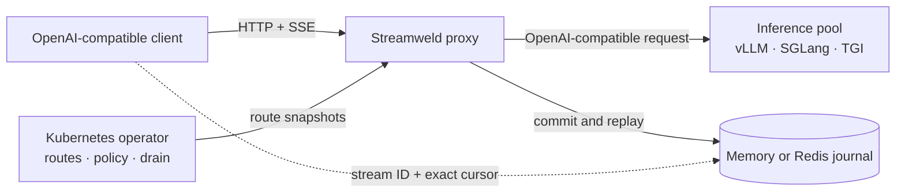

<h1 align="center">Streamweld</h1>

<div align="center">


Durable token streams for self-hosted LLM inference.

[Website](https://streamweld.vercel.app/) | [Documentation](https://streamweld.readthedocs.io/en/latest/) | [Get started](https://streamweld.readthedocs.io/en/latest/getting-started/) | [Architecture](https://streamweld.readthedocs.io/en/latest/concepts/architecture/) | [Discussions](https://github.com/satwiksps/streamweld/discussions)

[](https://github.com/satwiksps/streamweld/actions/workflows/ci.yml?query=branch%3Amain)
[](https://streamweld.readthedocs.io/en/latest/)
[](https://github.com/satwiksps/streamweld/actions/workflows/security.yml?query=branch%3Amain)
[](go.mod)
[](LICENSE)

</div>

Streamweld is an OpenAI-compatible durability layer for self-hosted LLM
inference. It gives each streaming generation an identity, an append-only
journal, and an exact resume cursor that can outlive a reader connection or
backend attempt.

> [!IMPORTANT]
> **Pre-release:** source, tests, documentation, and deterministic failure
> evidence are public. Versioned binaries, container images, the Helm OCI chart,
> and npm packages have not been published yet. APIs and `v1alpha1` Kubernetes
> resources may change before the first release.

## Why Streamweld

Long LLM responses are vulnerable to pod failures, rolling updates, reclaimed
nodes, proxy timeouts, and client network changes. A normal retry restarts the
request and can discard generated output. Streamweld makes three operations
explicit:

- **Reader resume:** replay after an exact `Last-Event-ID`, then join the live tail.
- **Producer migration:** continue on a compatible backend only when every safety gate passes.
- **User stop:** cancel generation explicitly; a disconnected reader is not treated as stop.

## Architecture



The Go proxy owns the request and streaming data path. The journal owns ordered
events, replay, and terminal state. The Kubernetes operator manages eligible
backends and rollout draining without reading prompts or generated text.

## Run from source

Requirements: Go 1.25+, Node.js 20.19+, and pnpm 11.19.

```sh
git clone https://github.com/satwiksps/streamweld.git
cd streamweld
make bootstrap
make test
```

Run the CPU-only Kubernetes end-to-end path with Docker, kind, `kubectl`, and
Helm installed:

```sh
make e2e
```

See the [ten-minute guide](https://streamweld.readthedocs.io/en/latest/getting-started/)
for the complete installation walkthrough and the distinction between the
current source flow and the forthcoming `v0.1.0` release flow.

## Safety boundary

Migration is deliberately conservative. The target must pass model, tokenizer,
chat-template, request-shape, token-budget, structured-output, tool-call, and
terminal-state checks. Unsafe continuation is refused instead of silently
returning a corrupted answer.

Use `streamweldctl doctor` to probe a specific immutable backend/model/tokenizer
tuple before enabling migration:

```sh
streamweldctl doctor --backend http://127.0.0.1:8000 --model MODEL --json
```

<!-- streamweld:benchmarks:start -->
## Evidence

The committed `deterministic-local` profile checks complete output across 9 deterministic fault scenarios. It is an in-process correctness model, not a Kubernetes or GPU benchmark. The scheduled [`kind` matrix](.github/workflows/nightly.yml) is the physical failure gate. See the [results](benchmarks/results.md) and [methodology](benchmarks/README.md).
<!-- streamweld:benchmarks:end -->

## Documentation

- [Durability guarantees](https://streamweld.readthedocs.io/en/latest/concepts/durability/)
- [Architecture](https://streamweld.readthedocs.io/en/latest/concepts/architecture/)
- [Resume and stop protocol](https://streamweld.readthedocs.io/en/latest/protocol/resume-and-stop/)
- [Production operations](https://streamweld.readthedocs.io/en/latest/operations/production/)
- [TypeScript integration](https://streamweld.readthedocs.io/en/latest/sdk/typescript/)

## Contributing

Read [CONTRIBUTING.md](CONTRIBUTING.md) before opening a pull request. Security
issues should follow [SECURITY.md](SECURITY.md), not the public issue tracker.

Apache License 2.0. See [LICENSE](LICENSE).
