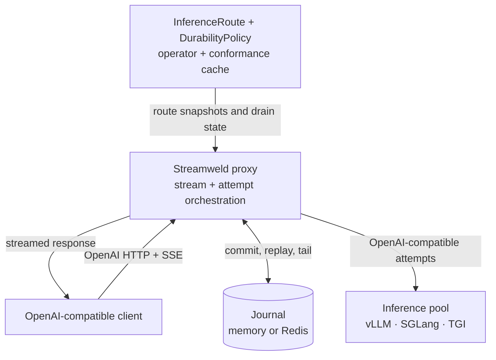

# Architecture

Streamweld is intentionally a narrow layer between an OpenAI-compatible client
and self-hosted inference backends.

## Data plane

The Go proxy validates a bounded request, chooses an eligible backend, creates
the journal stream, and forwards complete upstream SSE events. Journal commit
drives producer progress; downstream readers consume independently. Ordinary
non-streaming requests bypass the journal.

When an attempt fails, the proxy evaluates route policy, model version,
chat-template verdict, request shape, token limits, structured-output prefix,
tool-call boundaries, and migration budget before continuing elsewhere. It
reconciles the new output with a bounded suffix of the accepted text.

## Journal plane

The journal owns ordered sequence allocation, terminal closure, retention,
idempotency bindings, replay, and the atomic replay-to-tail boundary. Memory mode
is bounded and process-local. Redis mode adds shared state across proxy replicas.

## Kubernetes control plane

The operator watches `InferenceRoute`, `DurabilityPolicy`, Pods, and
EndpointSlices. It probes immutable backend/model/template tuples and sends a
generation-fenced route snapshot to every proxy replica. A pre-stop drain hook
removes the backend from new selection and waits for attempt leases to reach
zero before termination proceeds.

The operator never reads prompts or generated text. Its job is eligibility,
routing state, and lifecycle coordination.
