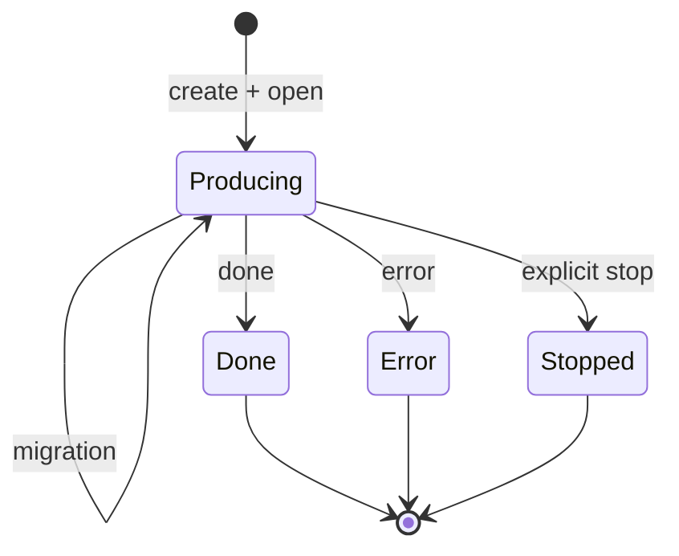

Streamweld treats a generation as a durable logical stream instead of treating
one HTTP connection as the generation. That distinction lets a reader reconnect
without restarting inference and lets a producer move only when continuation is
safe.

## The contract

1. Every durable generation has one canonical lowercase ULID.
2. Its append-only journal starts with `open` at sequence 1 and increases by one.
3. `done`, `error`, and `stopped` are final; nothing can be appended afterward.
4. A journal entry is committed before it is exposed for replay.
5. `Last-Event-ID: N` is exclusive: the next response starts after `N`.
6. Replay joins the live tail without a gap or duplicate.
7. A disconnected reader never implies stop.
8. A slow reader cannot hold back the producer or another reader.
9. Only complete SSE events and valid UTF-8 enter the journal.
10. Producer migration runs only after every correctness gate passes.

Migration is an event inside the producing state, not a terminal state. Each
backend request is an *attempt*. Readers are independent views over the same
ordered journal.

## Failure semantics are explicit

| Failure | Observable behavior |
|---|---|
| Reader socket closes | Producer follows the configured orphan policy; default is continue |
| Reader reconnects | Replay begins strictly after its exact cursor, then tails live |
| Backend attempt fails | Migrate only if policy and safety predicates allow it |
| Migration is unsafe | Commit a warning, then terminal `migration_refused` error |
| User calls stop | Cancel the producer and commit terminal `stopped` |
| Journal cannot open | Serve inference in degraded pass-through mode without a stream ID |
| Journal fails mid-stream | Keep attached readers live with an explicitly unsequenced, non-resumable suffix |

## Durability is scoped

Memory journals support one proxy replica and do not survive process exit. Redis
enables cross-replica replay and shared idempotency. An optional owner relay keeps
an already-connected remote reader live through a Redis outage, but it cannot
recover an uncommitted suffix after the owner process dies.

The normative, implementation-level contract lives in the
[protocol document](https://github.com/satwiksps/streamweld/blob/main/docs/protocol.md).
