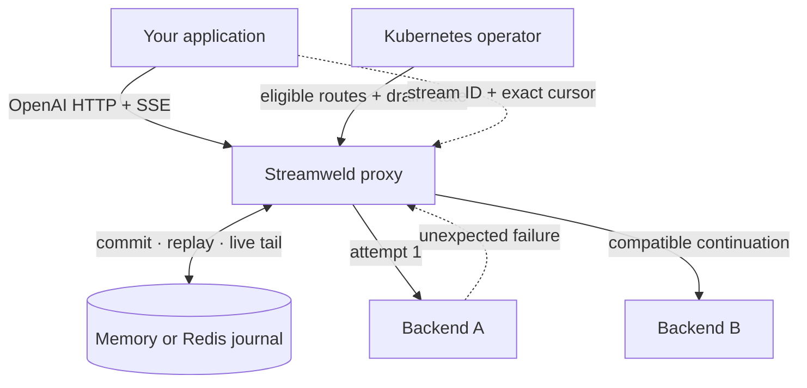

# Streamweld

**Durable token streams for self-hosted LLM inference.**

Streamweld is an OpenAI-compatible proxy and Kubernetes operator that keeps one
logical LLM response recoverable across reader disconnects and eligible backend
failures. Each generation receives an identity, an append-only journal, and an
exact resume cursor.

[Install Streamweld](getting-started.md){ .md-button .md-button--primary }
[Understand the durability contract](concepts/durability.md){ .md-button }

!!! caution "Pre-release"

    The source tree is runnable today. Versioned binaries, images, charts, and
    npm packages will be published with the first release.



The application still speaks the OpenAI streaming API, and the inference
servers still generate the response. Streamweld owns only the durable boundary
between them: stream identity, ordered events, replay, and guarded continuation.

## What Streamweld provides

<div class="grid cards" markdown>

-   **Exact reader resume**

    Replay strictly after the last committed cursor, then rejoin the live tail
    without a missing or duplicate event.

-   **Guarded producer migration**

    Continue a logical stream on another backend only when request, model,
    template, sampling, and seam checks make migration eligible.

-   **Durable event ordering**

    Commit each ordered SSE event to memory or Redis before it becomes visible
    to any reader.

-   **Kubernetes-native operation**

    Use the proxy, operator, Helm chart, compatibility probes, drain policy, and
    OpenTelemetry signals with self-hosted inference pools.

</div>

## Quick start

```bash
git clone https://github.com/satwiksps/streamweld.git
cd streamweld
make bootstrap
make test
```

Continue to [installation and the first cluster](getting-started.md) to build the
source, install Streamweld into kind, and exercise reader and producer recovery.

## Choose the right section

| If you want to | Start here |
| --- | --- |
| Install from source | [Installation and first cluster](getting-started.md) |
| Understand the durability boundary | [Durability contract](concepts/durability.md) |
| Understand the data and control planes | [Architecture](concepts/architecture.md) |
| Implement an exact resume cursor | [Resume and stop](protocol/resume-and-stop.md) |
| Evaluate producer continuation | [Producer migration](protocol/producer-migration.md) |
| Configure routes and backends | [Kubernetes operation](operations/kubernetes.md) |
| Integrate a TypeScript client | [TypeScript clients](sdk/typescript.md) |
| Review protocol-level behavior | [HTTP and SSE reference](reference/http-and-sse.md) |

## Scope

Streamweld is a durability layer, not a model server, scheduler, authentication
gateway, or billing system. It continues a generation only when compatibility
probes and runtime safety predicates make the continuation eligible.
