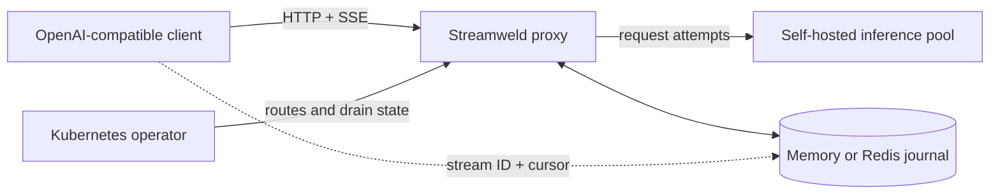

import { Card, CardGrid } from '@astrojs/starlight/components';

Streamweld is an OpenAI-compatible proxy and Kubernetes operator that keeps one
logical LLM response recoverable across reader disconnects and eligible backend
failures.

:::note[Pre-release]
The source tree is runnable today. Versioned binaries, container images, the
Helm OCI chart, and npm packages will be published with the first release.
:::

## Start here

<CardGrid>
	<Card title="Install from source" icon="rocket">
		Follow the [ten-minute guide](getting-started/) to build the source, install
		the chart into kind, and exercise the durable request path.
	</Card>
	<Card title="Understand the contract" icon="document">
		Read the [durability guarantees](concepts/durability/) before choosing journal
		and migration policies.
	</Card>
	<Card title="Operate in Kubernetes" icon="seti:config">
		Configure [routes, policies, Redis, draining, and observability](operations/kubernetes/).
	</Card>
</CardGrid>

## System boundary

Streamweld is a durability layer, not a model server, scheduler, authentication
gateway, or billing system. It continues a generation only when compatibility
probes and runtime safety predicates make the continuation eligible.

## Key concepts

- **Reader resume** replays strictly after an exact cursor and then tails live.
- **Producer migration** creates a new backend attempt without changing the logical stream.
- **Explicit stop** is terminal; dropping a socket only detaches that reader.
- **Journal commit** happens before an event becomes visible for replay.

For implementation-level details, continue to the [architecture](concepts/architecture/)
or the [normative protocol](source/protocol/).
